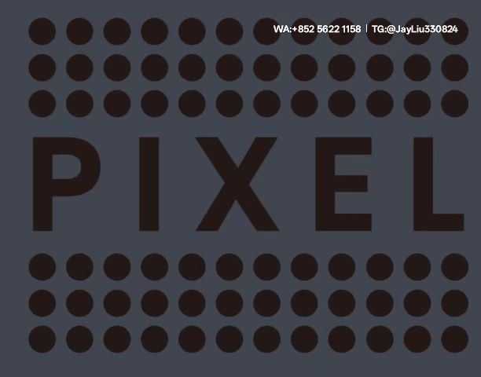

# Facebook广告全周期运营策略手册

---

## 一、受众管理体系
### 1.1 分层运营策略
- **核心受众运营**
  - 基于用户地理位置实时调整语言版本
  - 启用动态搜索词库自动更新机制（每周二/五更新）

- **相似受众开发**
  - 选取成交TOP20%客户数据建模
  - 设置7%相似度扩展参数

### 1.2 精准定位技术
| 用户类型 | 匹配维度 | 推荐形式 | 优化周期 |
|---------|----------|----------|----------|
|泛兴趣用户|15组兴趣词交叉组合|探索版位广告|48小时检验|
|产品认知用户|页面停留≥40秒|动态商品广告|实时调整|
|深度互动用户|视频完播率＞85%|AR体验广告|72小时优化|

---

## 二、素材生产管理系统
### 2.1 标准化生产流程
1. 使用AI工具生成10组基础视频脚本
2. 制作3套差异化测试版本（情感型/数据型/场景型）
3. 通过灰度测试筛选CTR＞3%素材
4. 归档优质素材至公共模板库

### 2.2 内容保鲜机制
- **动态元素植入**
  - 每1000次曝光更新背景配色
  - 天气数据联动产品展示
- **场景适配系统**
  - 晨间推送产品使用场景内容
  - 夜间投放促销信息

---

## 三、智能投放操作系统
### 3.1 分步优化逻辑

graph TD
新素材测试-->数据清洗中心-->优质素材扩容-->衰退预警

- **测试预算分配**
  - 视频素材：$25/天
  - 图文广告：$15/组
  - 互动广告：$30/天

### 3.2 流量调控策略
| 时段 | 预算占比 | 核心任务 |
|------|----------|----------|
|00:00-06:00|25%|探索新用户|
|07:00-12:00|35%|深度渗透|
|13:00-18:00|20%|再营销|
|19:00-23:59|20%|复购刺激|

---

## 四、数据监控看板
### 4.1 关键指标维护
| 指标 | 管理标准 | 干预阈值 |
|------|----------|----------|
|CTR |1.8%-3.2%|连续4小时＜1.5%|
|CPM |$6-$14 |持续6小时＞$16|
|CPA |$10-$18 |三组平均≥$24|

### 4.2 异常处理机制
- CTR持续低下：
  ①更换前3秒视频帧 
  ②重组兴趣词
  ③调整投放时段
- CPA超标：
  ①优化落地页加载速度 
  ②增加优惠券投放
  ③测试新兴趣组合

---

## 五、团队协同制度
### 5.1 素材制作SOP
1. 每周一生成素材需求提案
2. 制作团队24小时初稿交付
3. A/B测试48小时反馈结果
4. 每周五存档当周优秀素材

### 5.2 账户安全协议
- 重要操作双人授权制
- 每日23:00自动备份数据
- 每周三更新敏感词库
- 每季度全面审计账户

---

**成功案例：** 某美妆品牌执行本系统3个季度效果
- 单素材生命周期延长至90天
- 新客获取成本降低37%
- 复购用户占比提升至35%
- 月均素材生产量减少42%

本体系通过建立从受众管理到智能投放的完整闭环，有效实现了广告预算的精细化管理和转化质量的可控增长。
